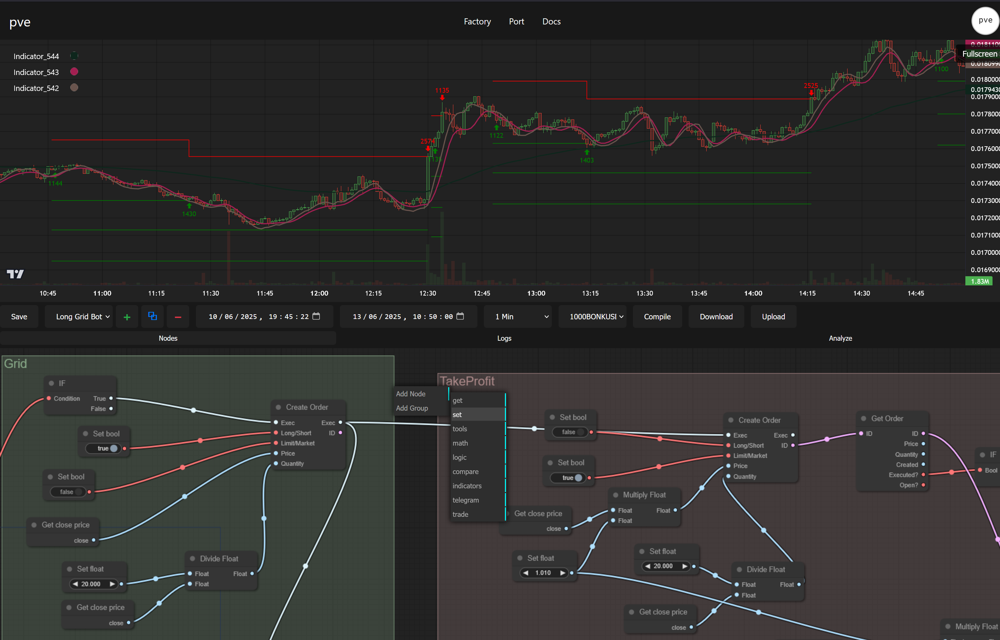
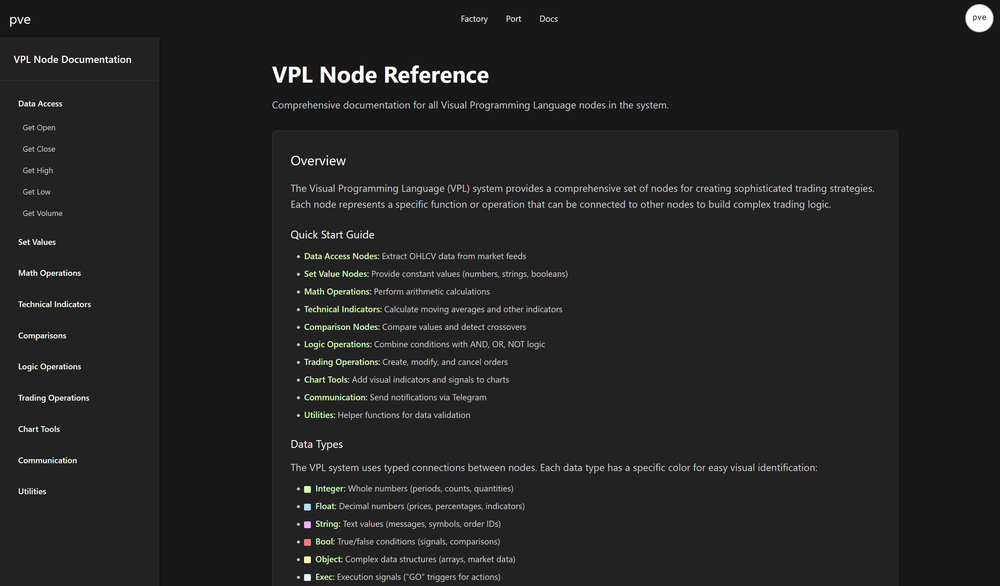
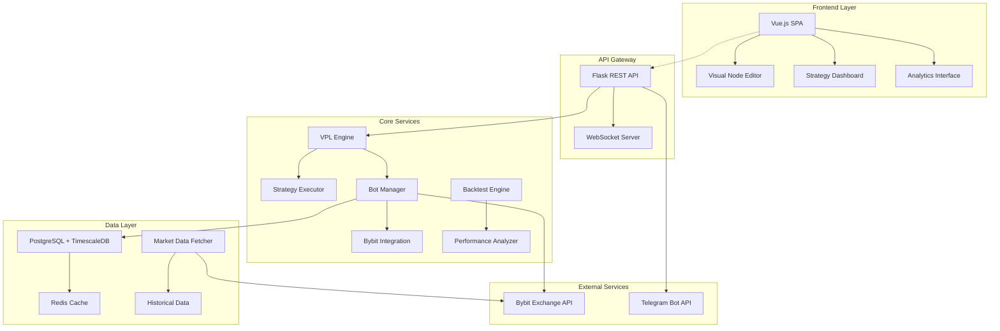

# 🚀 PVE (Platform Visual Engine)

<div align="center">

**A Visual Programming Language for Cryptocurrency Trading Strategies**

[](https://opensource.org/licenses/Apache-2.0)
[](https://vuejs.org/)
[](https://python.org/)
[](https://typescriptlang.org/)

[Features](#-features) • [Architecture](#-architecture) • [Quick Start](#-quick-start) • [Documentation](#-documentation) • [Contributing](#-contributing)

</div>

## 📝 Overview

PVE is a sophisticated visual programming platform that enables traders to create, backtest, and deploy cryptocurrency trading strategies using an intuitive node-based editor. Think of it as "Unreal Engine's Blueprint system, but for trading strategies."

### 🎯 What Makes PVE Special

- **Visual Strategy Creation**: Build complex trading logic using drag-and-drop nodes
- **Real-time Backtesting**: Test strategies on historical data with detailed analytics
- **Live Trading Integration**: Deploy strategies on Bybit exchange with full automation
- **Advanced Analytics**: Comprehensive performance metrics and trade analysis
- **WebSocket Real-time Data**: Live market data and strategy execution monitoring

## 📸 Screenshots

### 🏭 Visual Strategy Factory
Create sophisticated trading strategies using our intuitive drag-and-drop interface:



### 📚 Documentation & Learning Hub
Comprehensive guides and tutorials to master the platform:



## ✨ Features

### 🎨 Visual Programming Language (VPL)
- **Node-based Editor**: Create strategies using 50+ pre-built nodes
- **Technical Indicators**: RSI, Bollinger Bands, Moving Averages, Supertrend, and more
- **Trading Operations**: Market/limit orders, position management, risk controls
- **Logic Operations**: Conditional logic, comparisons, mathematical operations
- **Data Access**: OHLCV data, volume, custom timeframes
- **Notifications**: Telegram integration for alerts and trade notifications

### 📊 Strategy Management
- **Backtesting Engine**: Historical data testing with realistic execution simulation
- **Performance Analytics**: Sharpe ratio, max drawdown, win rate, PnL analysis
- **Strategy Library**: Save, load, and share trading strategies
- **Template Strategies**: Pre-built examples for common trading patterns
- **Live Deployment**: Seamless transition from backtest to live trading

### 🔧 Technical Infrastructure
- **Real-time Data**: Live market data streaming from Bybit
- **Database Integration**: PostgreSQL with TimescaleDB for efficient time-series data
- **Microservices Architecture**: Scalable backend with Docker containerization
- **WebSocket Communication**: Real-time updates and notifications
- **Background Processing**: Celery for asynchronous task execution

## 🏗️ Architecture



### 🧩 Component Breakdown

#### Frontend (Vue.js + TypeScript)
- **Visual Editor**: LiteGraph.js-based node editor for strategy creation
- **Dashboard**: Real-time monitoring of active strategies and performance
- **Authentication**: Telegram-based user authentication
- **Charts**: Advanced trading charts with TradingView-style interface

#### Backend (Python Flask)
- **VPL Engine**: Executes visual programming graphs as trading strategies
- **Bot Manager**: Manages multiple trading bot instances per user
- **API Layer**: RESTful endpoints for strategy management and data access
- **WebSocket Server**: Real-time communication for live updates

#### Data Management
- **PostgreSQL**: User data, strategies, backtest results, bot configurations
- **TimescaleDB**: Optimized time-series storage for market data
- **Redis**: Caching, session management, and pub/sub messaging
- **Celery**: Background task processing for backtests and data fetching

#### Integration Layer
- **Bybit API**: Live trading execution and market data streaming
- **Telegram API**: User authentication and trade notifications
- **Docker**: Containerized deployment with docker-compose

## 🚀 Quick Start

### Prerequisites

- **Docker & Docker Compose** (recommended)
- **Python 3.10+** (for local development)
- **Node.js 18+** (for frontend development)
- **PostgreSQL 14+** (if running without Docker)

### 🐳 Docker Setup (Recommended)

1. **Clone the repository**
   ```bash
   git clone https://github.com/yourusername/pve.git
   cd pve
   ```

2. **Configure environment variables**
   ```bash
   cp env.example .env
   # Edit .env with your configurations (see Configuration section)
   ```

3. **Start the platform**
   ```bash
   docker-compose up -d
   ```

4. **Access the application**
   - Frontend: `http://localhost:3000`
   - API: `http://localhost:5001`
   - Database: `localhost:5432`

### ⚙️ Configuration

Copy `env.example` to `.env` and configure the following:

#### Required Configuration
```bash
# Telegram Bot Token (get from @BotFather)
TELEGRAM_BOT_TOKEN=your_telegram_bot_token

# JWT Secret (generate with: openssl rand -hex 64)
JWT_SECRET=your_secure_jwt_secret

# Bybit API (for live trading)
BYBIT_API_KEY=your_bybit_api_key
BYBIT_API_SECRET=your_bybit_secret
```

#### Optional Configuration
```bash
# Database
DB_HOST=postgresql
DB_NAME=postgres
DB_USER=postgres
DB_PASSWORD=postgres

# Environment
FLASK_ENV=development
VITE_APP_ENV=dev
```

### 🔧 Development Setup

#### Backend Development
```bash
cd backend
python -m venv venv
source venv/bin/activate  # On Windows: venv\Scripts\activate
pip install -r requirements.txt
python pve/run.py
```

#### Frontend Development
```bash
npm install
npm run dev
```

## 📚 Documentation

### 🎮 Getting Started
1. **Create Account**: Sign in using Telegram authentication
2. **Visual Strategy Builder**: Use the node editor to create your first strategy
3. **Backtest**: Test your strategy on historical data
4. **Deploy**: Connect your Bybit API and deploy live
5. **Monitor**: Track performance in real-time

### 🧱 Available Nodes

#### Data Access Nodes
- **OHLCV**: Open, High, Low, Close, Volume data access
- **Timeframe**: Multi-timeframe data support
- **Historical**: Access to historical market data

#### Technical Indicators
- **Moving Averages**: SMA, EMA, WMA with customizable periods
- **RSI**: Relative Strength Index with overbought/oversold levels
- **Bollinger Bands**: Price volatility analysis
- **Supertrend**: Trend-following indicator
- **Custom Indicators**: Build your own using mathematical operations

#### Trading Operations
- **Create Order**: Market and limit order placement
- **Modify Order**: Update existing orders
- **Cancel Order**: Order cancellation
- **Position Management**: Get current positions and PnL
- **Risk Management**: Stop-loss and take-profit automation

#### Logic & Math
- **Comparisons**: Greater than, less than, equal to
- **Boolean Logic**: AND, OR, NOT operations
- **Mathematical**: Add, subtract, multiply, divide, min, max
- **Conditional**: If-then-else logic flow

### 📊 Strategy Examples

#### Simple RSI Strategy
```
Market Data → RSI(14) → Compare(< 30) → Buy Signal
                    → Compare(> 70) → Sell Signal
```

#### Bollinger Band Breakout
```
Market Data → Bollinger Bands → Price Above Upper Band → Buy
                             → Price Below Lower Band → Sell
```

## 🛠️ Development

### Project Structure
```
pve/
├── src/                     # Vue.js frontend
│   ├── components/          # Vue components
│   ├── stores/             # Pinia state management
│   └── views/              # Page components
├── backend/
│   └── pve/
│       ├── app/            # Flask application
│       │   ├── models/     # Database models
│       │   ├── routes/     # API endpoints
│       │   ├── vpl/        # Visual programming engine
│       │   └── pvebot/     # Trading bot management
│       └── config.py       # Configuration
├── docker-compose.yml      # Docker orchestration
└── README.md
```

### Adding New Nodes

1. Create node logic in `src/components/custom_nodes/`
2. Register in `src/stores/graph.ts`
3. Add backend processing in `backend/pve/app/vpl/nodes.py`

### API Endpoints

#### Authentication
- `POST /api/telegram-auth` - Telegram OAuth
- `GET /api/verify-token` - Token verification

#### Strategy Management
- `GET /api/get-graphs` - List user strategies
- `POST /api/save-graph` - Save strategy
- `POST /api/run-backtest` - Execute backtest

#### Bot Management
- `GET /api/get-bots` - List user bots
- `POST /api/create-bot` - Deploy new bot
- `POST /api/start-bot` - Start bot execution

## 🤝 Contributing

We welcome contributions! Please see our [Contributing Guidelines](CONTRIBUTING.md) for details.

### Areas for Contribution
- **New Trading Indicators**: Implement additional technical analysis tools
- **Exchange Integrations**: Add support for more cryptocurrency exchanges
- **UI/UX Improvements**: Enhance the visual editor and dashboard
- **Performance Optimizations**: Improve backtesting speed and accuracy
- **Documentation**: Improve guides and API documentation

## ⚠️ Disclaimer

**This software is for educational and research purposes only. Trading cryptocurrencies involves substantial risk of loss and is not suitable for all investors. Always do your own research and never invest more than you can afford to lose.**

- Past performance does not guarantee future results
- Backtesting may not reflect real market conditions
- Live trading requires careful risk management
- Always test strategies thoroughly before deploying capital

## 📄 License

This project is licensed under the Apache License 2.0 - see the [LICENSE](LICENSE) file for details.

## 🙏 Acknowledgments

- [LiteGraph.js](https://github.com/jagenjo/litegraph.js) - Visual programming framework
- [Vue.js](https://vuejs.org/) - Progressive JavaScript framework
- [Flask](https://flask.palletsprojects.com/) - Python web framework
- [Bybit](https://www.bybit.com/) - Cryptocurrency exchange integration
- [TimescaleDB](https://www.timescale.com/) - Time-series database

---

<div align="center">

**Made with ❤️ by the PVE Community**

[🌟 Star us on GitHub](https://github.com/yourusername/pve) • [🐛 Report Issues](https://github.com/yourusername/pve/issues) • [💬 Join Discussion](https://github.com/yourusername/pve/discussions)

</div>
